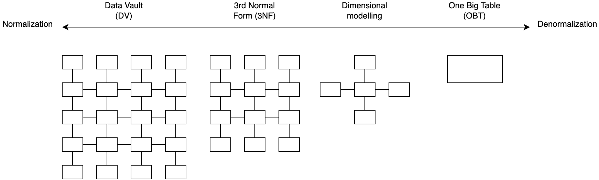
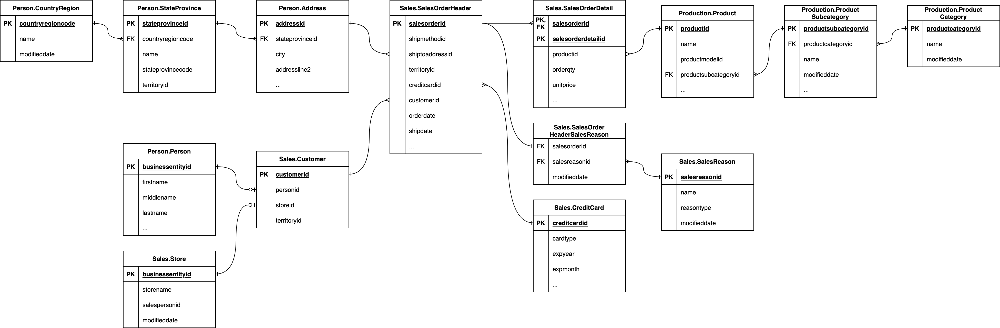

# Building a Kimball dimensional model with dbt <!-- omit in toc -->
[Building a Kimball dimensional model with dbt _ dbt Developer Blog](https://docs.getdbt.com/blog/kimball-dimensional-model) をやるよ。

# 目次 <!-- omit in toc -->
- [解説](#解説)
    - [はじめに](#はじめに)
    - [Dimentional modeling とは](#dimentional-modeling-とは)
    - [準備](#準備)
    - [Part 1: Setup dbt project and database](#part-1-setup-dbt-project-and-database)
        - [Step 1: Before you get started](#step-1-before-you-get-started)
        - [Step 2: Clone the repository](#step-2-clone-the-repository)
        - [Step 3: Install dbt database adaptors](#step-3-install-dbt-database-adaptors)
        - [Step 4: Setup dbt profile](#step-4-setup-dbt-profile)
        - [Step 5: Install dbt dependencies](#step-5-install-dbt-dependencies)
        - [Step 6: Seed your database](#step-6-seed-your-database)
        - [Step 7: Examine the database source schema](#step-7-examine-the-database-source-schema)
        - [Step 8: Query the tables](#step-8-query-the-tables)
    - [Part 2: Identify the business process](#part-2-identify-the-business-process)
    - [Part 3: Identify the fact and dimension tables](#part-3-identify-the-fact-and-dimension-tables)
    - [Fact tables](#fact-tables)
    - [Dimension tables](#dimension-tables)
    - [Part 4: Create the dimension tables](#part-4-create-the-dimension-tables)
        - [Step 1: Create model files](#step-1-create-model-files)
        - [Step 2: Fetch data from the upstream tables](#step-2-fetch-data-from-the-upstream-tables)
        - [Step 3: Perform the joins](#step-3-perform-the-joins)
        - [Step 4: Create the surrogate key](#step-4-create-the-surrogate-key)
        - [Step 5: Select dimension table columns](#step-5-select-dimension-table-columns)
        - [Step 6: Choose a materialization type](#step-6-choose-a-materialization-type)
        - [Step 7: Create model documentation and tests](#step-7-create-model-documentation-and-tests)
        - [Step 8: Build dbt models](#step-8-build-dbt-models)
    - [Part 5: Create the fact table](#part-5-create-the-fact-table)
        - [Step 1: Create model files](#step-1-create-model-files-1)
        - [Step 2: Fetch data from the upstream tables](#step-2-fetch-data-from-the-upstream-tables-1)
        - [Step 3: Perform joins](#step-3-perform-joins)
        - [Step 4: Create the surrogate key](#step-4-create-the-surrogate-key-1)
        - [Step 5: Select fact table columns](#step-5-select-fact-table-columns)
        - [Step 6: Create foreign surrogate keys](#step-6-create-foreign-surrogate-keys)
        - [Step 7: Choose a materialization type](#step-7-choose-a-materialization-type)
        - [Step 8: Create model documentation and tests](#step-8-create-model-documentation-and-tests)
        - [Step 9: Build dbt models](#step-9-build-dbt-models)
    - [Part 6: Document the dimensional model relationships](#part-6-document-the-dimensional-model-relationships)
    - [Part 7: Consume dimensional model](#part-7-consume-dimensional-model)

# 解説
## はじめに
Dimentional modeling はデータモデリング手法（※）の一つで、分析用に最も広く採用されている手法です。
にもかかわらず、世の中には dbt を使って dimentional modeling を行うための資料が足りていません。。。つらいね。。。というわけで、このチュートリアルで dimentional modeling の決定版ガイドを提供したいと思います。

（※）その他のデータモデリング手法には、Data Vault (DV)、Third Normal Form (3NF)、One Big Table (OBT) などがあります。[元記事より拝借](https://docs.getdbt.com/img/blog/2023-04-18-building-a-kimball-dimensional-model-with-dbt/data-modelling.png)：



このチュートリアルを完了すると、次のことができるようになります。

- dimentional modeling の概念を理解する
- モック dbt プロジェクトとデータベースをセットアップする
- モデル化するビジネス プロセスを特定する
- ファクト テーブルとディメンション テーブルを特定する
- ディメンション テーブルを作成する
- ファクト テーブルを作成する
- dimentional modeling のリレーションをドキュメント化する
- dimentional modeling を使用する

## Dimentional modeling とは
Dimentional modeling は、1996年にRalph Kimball氏が著書「The Data Warehouse Toolkit」で紹介した手法です。
Dimentional modeling の目的は、raw データを、ビジネスを表現するファクトテーブルとディメンションテーブルに変換することです。

ディメンショナルモデリングのメリットを挙げます：

- 分析用のデータモデルがよりシンプルになる： 分析用にdimentional model を使用する際、ファクトテーブルとディメンションテーブル間の結合は、サロゲートキーを使用することで簡単に行うことができ、複雑な結合を行う必要がない
- Don’t repeat yourself[^1]：ディメンションは、他のファクトテーブルで簡単に再利用でき、労力とコード・ロジックの重複を避けることができます。再利用可能なディメンジョンは、[コンフォームド・ディメンジョン](https://www.kimballgroup.com/data-warehouse-business-intelligence-resources/kimball-techniques/dimensional-modeling-techniques/conformed-dimension/)と呼ばれます。
- データ検索の高速化： Dimentional model に対して実行される分析クエリは、結合や集約などのデータ変換がすでに適用されているため、3NFモデルよりも大幅に高速です。
- 実際のビジネスプロセスとの密接な整合性：ビジネスプロセスとメトリクスは、dimentional model の一部としてモデル化され、計算される。これにより、モデル化されたデータが容易に利用できるようになる

[^1]: DRYとは、"Don't Repeat Yourself "の略で、ソフトウェア開発の原則の1つです。この原則に従うと、繰り返しのパターンや重複するコードやロジックを減らし、モジュール化された参照可能なコードにすることを目指すことになります。

さて、dimentional modeling の大まかな概念と利点を理解したところで、実際に dbt を使用して最初の dimentional model を作成してみましょう。

## 準備
実行環境は docker で作成します。Docker Desktop version 23.0.5 で動作確認しています。

## Part 1: Setup dbt project and database
### Step 1: Before you get started

これらを準備します：

- [DuckDB](https://duckdb.org/docs/installation/index) または [PostgreSQL](https://www.postgresql.org/download/) 
- Python 3.8 以上
- dbt 1.3.0 以上
- SQLの基本的な理解
- dbtの基本的な理解

はい、作りましょう。[^1]

[^1]: ここでは PostgreSQL を使用します

```
$ docker compose up -d --build

[+] Running 2/2
 - Container kimball-dimensional-model-dev_postgres-1  Started                                           1.2s
 - Container kimball-dimensional-model-dev_dbt-1       Started                                           1.3s
```

dbt コマンドの確認と、 PostgreSQL への疎通確認をします。

```
$ docker compose exec dev_dbt dbt debug
18:06:40  Running with dbt=1.5.0
18:06:40  dbt version: 1.5.0
18:06:40  python version: 3.11.2
18:06:40  python path: /usr/local/bin/python
18:06:40  os info: Linux-5.10.16.3-microsoft-standard-WSL2-x86_64-with-glibc2.31
18:06:40  Using profiles.yml file at /root/.dbt/profiles.yml
18:06:40  Using dbt_project.yml file at /usr/app/dbt/dbt_project.yml
18:06:40  Configuration:
18:06:40    profiles.yml file [OK found and valid]
18:06:40    dbt_project.yml file [ERROR not found]
18:06:40  Required dependencies:
18:06:40   - git [OK found]

18:06:40  Connection:
18:06:40    host: localhost
18:06:40    port: 5430
18:06:40    user: postgres
18:06:40    database: adventureworks
18:06:40    schema: dbo
18:06:40    search_path: None
18:06:40    keepalives_idle: 0
18:06:40    sslmode: None
18:06:40    Connection test: [OK connection ok]

18:06:40  1 check failed:
18:06:40  Could not load dbt_project.yml
```

`dbt_project.yml` はまだ作っていないので、これでOKです。

### Step 2: Clone the repository

ソースコードがあるリポジトリをcloneしましょう。

```
git clone https://github.com/Data-Engineer-Camp/dbt-dimensional-modelling.git
cd dbt-dimensional-modelling/adventureworks
```

<details>
<summary>実行例</summary>

```
root@docker-desktop:/usr/app/dbt# git clone https://github.com/Data-Engineer-Camp/dbt-dimensional-modelling.git
Cloning into 'dbt-dimensional-modelling'...
remote: Enumerating objects: 361, done.
remote: Counting objects: 100% (80/80), done.
remote: Compressing objects: 100% (16/16), done.
remote: Total 361 (delta 66), reused 64 (delta 64), pack-reused 281
Receiving objects: 100% (361/361), 4.55 MiB | 3.75 MiB/s, done.
Resolving deltas: 100% (176/176), done.
root@docker-desktop:/usr/app/dbt# cd dbt-dimensional-modelling/adventureworks
```

</details>

### Step 3: Install dbt database adaptors

インストール済み docker コンテナを立ち上げている（はず）なのでOK。

<details>
<summary>確認コマンド</summary>

```
$ docker compose exec dev_dbt pip freeze | grep dbt
dbt-core==1.5.0
dbt-extractor==0.4.1
dbt-postgres @ git+https://github.com/dbt-labs/dbt-core@dafb6aeb9338c3703f34cf2d0a79bd1ddca50d2f#subdirectory=plugins/postgres
```

</details>

### Step 4: Setup dbt profile

dbtプロファイル（`dbt-dimensional-modelling/aventureworks/profiles.yml` を参照）は、事前に設定済みです。
使用するデータベースの認証情報に合わせて、設定を確認・変更しましょう。

```yml
adventureworks:
  # target: duckdb
  target: postgres # postgresql を使うので変更
  outputs:
    duckdb:
     type: duckdb
     path: target/adventureworks.duckdb
     threads: 12
    postgres: # docker container 起動時の設定に合わせる。
      type: postgres
      host: localhost
      user: postgres
      # password: postgres
      password: "{{ env_var('POSTGRES_PASSWORD') }}"
      # port: 5432
      port: 5430 # 5430 -> 5432
      dbname: adventureworks # create this empty database beforehand 
      schema: dbo
      threads: 12
```

### Step 5: Install dbt dependencies

[`dbt_utils`](https://hub.getdbt.com/dbt-labs/dbt_utils/latest/) を使用するため、dbt deps でパッケージをインストールします：

```
dbt deps
```

（`dbt-dimensional-modelling/aventureworks/pachages.yml` を見ての通り、今回使用するのは `dbt_utils` のみです）

<details>
<summary>実行例</summary>

```
root@docker-desktop:/usr/app/dbt/dbt-dimensional-modelling/adventureworks# dbt deps
15:53:53  Running with dbt=1.5.0
15:53:53  Installing dbt-labs/dbt_utils
15:53:58  Installed from version 1.0.0
15:53:58  Updated version available: 1.1.0
15:53:58
15:53:58  Updates available for packages: ['dbt-labs/dbt_utils']
Update your versions in packages.yml, then run dbt deps
```

（実行日（2023/5/30）時点で、dbt_utils 1.1.0 が出ているみたいですが、一旦このまま進めます）

</details>

### Step 6: Seed your database

[dbt seeds](https://docs.getdbt.com/docs/build/seeds) を使用して、今回使用する AdventureWorks （`dbt-dimensional-modelling/aventureworks/seeds/*` を参照）データを、使用するデータベースに追加していきます：

```
# seed duckdb # 今回は実行しないよ
# dbt seed --target duckdb

# seed postgres
dbt seed --target postgres
```

<details>
<summary>実行例</summary>

```
root@docker-desktop:/usr/app/dbt/dbt-dimensional-modelling/adventureworks# dbt seed --target postgres
16:14:16  Running with dbt=1.5.0
16:14:17  Unable to do partial parsing because profile has changed
16:14:17  Unable to do partial parsing because env vars used in profiles.yml have changed
16:14:20  Found 8 models, 42 tests, 0 snapshots, 0 analyses, 420 macros, 0 operations, 15 seed files, 0 sources, 0 exposures, 0 metrics, 0 groups
16:14:20
16:14:20  Concurrency: 12 threads (target='postgres')
16:14:20
16:14:20  1 of 15 START seed file person.address ......................................... [RUN]
16:14:20  2 of 15 START seed file person.countryregion ................................... [RUN]
16:14:20  3 of 15 START seed file sales.creditcard ....................................... [RUN]
16:14:20  4 of 15 START seed file sales.customer ......................................... [RUN]
16:14:20  5 of 15 START seed file date.date .............................................. [RUN]
16:14:20  6 of 15 START seed file person.person .......................................... [RUN]
16:14:20  7 of 15 START seed file production.product ..................................... [RUN]
16:14:20  8 of 15 START seed file production.productcategory ............................. [RUN]
16:14:20  9 of 15 START seed file production.productsubcategory .......................... [RUN]
16:14:20  10 of 15 START seed file sales.salesorderdetail ................................ [RUN]
16:14:20  11 of 15 START seed file sales.salesorderheader ................................ [RUN]
16:14:20  12 of 15 START seed file sales.salesorderheadersalesreason ..................... [RUN]
16:14:25  9 of 15 OK loaded seed file production.productsubcategory ...................... [INSERT 37 in 4.71s]
16:14:26  8 of 15 OK loaded seed file production.productcategory ......................... [INSERT 4 in 5.02s]
16:14:26  2 of 15 OK loaded seed file person.countryregion ............................... [INSERT 238 in 5.32s]
16:14:27  13 of 15 START seed file sales.salesreason ..................................... [RUN]
16:14:27  14 of 15 START seed file person.stateprovince .................................. [RUN]
16:14:27  15 of 15 START seed file sales.store ........................................... [RUN]
16:14:35  12 of 15 OK loaded seed file sales.salesorderheadersalesreason ................. [INSERT 1710 in 14.10s]
16:14:36  5 of 15 OK loaded seed file date.date .......................................... [INSERT 731 in 15.85s]
16:14:38  13 of 15 OK loaded seed file sales.salesreason ................................. [INSERT 10 in 10.89s]
16:14:40  14 of 15 OK loaded seed file person.stateprovince .............................. [INSERT 181 in 12.39s]
16:14:40  7 of 15 OK loaded seed file production.product ................................. [INSERT 504 in 20.03s]
16:14:41  15 of 15 OK loaded seed file sales.store ....................................... [INSERT 701 in 13.63s]
16:14:44  1 of 15 OK loaded seed file person.address ..................................... [INSERT 1675 in 23.38s]
16:14:50  6 of 15 OK loaded seed file person.person ...................................... [INSERT 2057 in 29.72s]
16:14:59  11 of 15 OK loaded seed file sales.salesorderheader ............................ [INSERT 1566 in 39.10s]
16:15:06  10 of 15 OK loaded seed file sales.salesorderdetail ............................ [INSERT 5716 in 46.04s]
16:15:15  4 of 15 OK loaded seed file sales.customer ..................................... [INSERT 19820 in 54.59s]
16:15:21  3 of 15 OK loaded seed file sales.creditcard ................................... [INSERT 19118 in 60.93s]
16:15:21
16:15:21  Finished running 15 seeds in 0 hours 1 minutes and 1.31 seconds (61.31s).
16:15:21
16:15:21  Completed successfully
16:15:21
16:15:21  Done. PASS=15 WARN=0 ERROR=0 SKIP=0 TOTAL=15
```

</details>


### Step 7: Examine the database source schema

ビジネスで生み出されたすべてのデータは、OLTP データベースに保存されています。
今回扱うビジネスデータについて、データベースのERD（Entity Relationship Diagram、ER図）を掲載します。
次のデータベースソーススキーマに注目しながら調べてみましょう：

- テーブル
- キー
- リレーション



### Step 8: Query the tables

クエリを発行して、レコードを見てみることで、より理解が深まるでしょう。例えば、次のクエリを実行してみます：

```sql
select * from sales.salesorderheader limit 10; 
```

`output`

```sql
 salesorderid | shipmethodid | billtoaddressid |    modifieddate     |               rowguid                |  taxamt   | shiptoaddressid | onlineorderflag | territoryid | status |      orderdate      | creditcardapprovalcode |  subtotal  | creditcardid | currencyrateid | revisionnumber |  freight  |       duedate       |  totaldue  | customerid | salespersonid |      shipdate       | accountnumber
--------------+--------------+-----------------+---------------------+--------------------------------------+-----------+-----------------+-----------------+-------------+--------+---------------------+------------------------+------------+--------------+----------------+----------------+-----------+---------------------+------------+------------+---------------+---------------------+----------------
        43659 |            5 |             985 | 2011-06-07 00:00:00 | 79b65321-39ca-4115-9cba-8fe0903e12e6 | 1971.5149 |             985 | f               |           5 |      5 | 2011-05-31 00:00:00 | 105041Vi84182          | 20565.6206 |        16281 |                |              8 |  616.0984 | 2011-06-12 00:00:00 | 23153.2339 |      29825 |           279 | 2011-06-07 00:00:00 | 10-4020-000676
        43660 |            5 |             921 | 2011-06-07 00:00:00 | 738dc42d-d03b-48a1-9822-f95a67ea7389 |  124.2483 |             921 | f               |           5 |      5 | 2011-05-31 00:00:00 | 115213Vi29411          |  1294.2529 |         5618 |                |              8 |   38.8276 | 2011-06-12 00:00:00 |  1457.3288 |      29672 |           279 | 2011-06-07 00:00:00 | 10-4020-000117
        43661 |            5 |             517 | 2011-06-07 00:00:00 | d91b9131-18a4-4a11-bc3a-90b6f53e9d74 | 3153.7696 |             517 | f               |           6 |      5 | 2011-05-31 00:00:00 | 85274Vi6854            | 32726.4786 |         1346 |              4 |              8 |   985.553 | 2011-06-12 00:00:00 | 36865.8012 |      29734 |           282 | 2011-06-07 00:00:00 | 10-4020-000442
        43662 |            5 |             482 | 2011-06-07 00:00:00 | 4a1ecfc0-cc3a-4740-b028-1c50bb48711c | 2775.1646 |             482 | f               |           6 |      5 | 2011-05-31 00:00:00 | 125295Vi53935          | 28832.5289 |        10456 |              4 |              8 |  867.2389 | 2011-06-12 00:00:00 | 32474.9324 |      29994 |           282 | 2011-06-07 00:00:00 | 10-4020-000227
        43663 |            5 |            1073 | 2011-06-07 00:00:00 | 9b1e7a40-6ae0-4ad3-811c-a64951857c4b |   40.2681 |            1073 | f               |           4 |      5 | 2011-05-31 00:00:00 | 45303Vi22691           |   419.4589 |         4322 |                |              8 |   12.5838 | 2011-06-12 00:00:00 |   472.3108 |      29565 |           276 | 2011-06-07 00:00:00 | 10-4020-000510
        43664 |            5 |             876 | 2011-06-07 00:00:00 | 22a8a5da-8c22-42ad-9241-839489b6ef0d | 2344.9921 |             876 | f               |           1 |      5 | 2011-05-31 00:00:00 | 95555Vi4081            | 24432.6088 |          806 |                |              8 |    732.81 | 2011-06-12 00:00:00 | 27510.4109 |      29898 |           280 | 2011-06-07 00:00:00 | 10-4020-000397
        43665 |            5 |             849 | 2011-06-07 00:00:00 | 5602c304-853c-43d7-9e79-76e320d476cf | 1375.9427 |             849 | f               |           1 |      5 | 2011-05-31 00:00:00 | 35568Vi78804           | 14352.7713 |        15232 |                |              8 |  429.9821 | 2011-06-12 00:00:00 | 16158.6961 |      29580 |           283 | 2011-06-07 00:00:00 | 10-4020-000146
        43666 |            5 |            1074 | 2011-06-07 00:00:00 | e2a90057-1366-4487-8a7e-8085845ff770 |  486.3747 |            1074 | f               |           4 |      5 | 2011-05-31 00:00:00 | 105623Vi69217          |  5056.4896 |        13349 |                |              8 |  151.9921 | 2011-06-12 00:00:00 |  5694.8564 |      30052 |           276 | 2011-06-07 00:00:00 | 10-4020-000514
```

dbt プロジェクトとデータベースのセットアップが完了したら、次はディメンションモデルに必要なテーブルを特定するパートに移ります。

## Part 2: Identify the business process
## Part 3: Identify the fact and dimension tables 
## Fact tables 
## Dimension tables
## Part 4: Create the dimension tables
### Step 1: Create model files
### Step 2: Fetch data from the upstream tables
### Step 3: Perform the joins
### Step 4: Create the surrogate key
### Step 5: Select dimension table columns
### Step 6: Choose a materialization type
### Step 7: Create model documentation and tests
### Step 8: Build dbt models
## Part 5: Create the fact table
### Step 1: Create model files
### Step 2: Fetch data from the upstream tables
### Step 3: Perform joins
### Step 4: Create the surrogate key
### Step 5: Select fact table columns
### Step 6: Create foreign surrogate keys
### Step 7: Choose a materialization type
### Step 8: Create model documentation and tests
### Step 9: Build dbt models
## Part 6: Document the dimensional model relationships
## Part 7: Consume dimensional model
Learning resources
