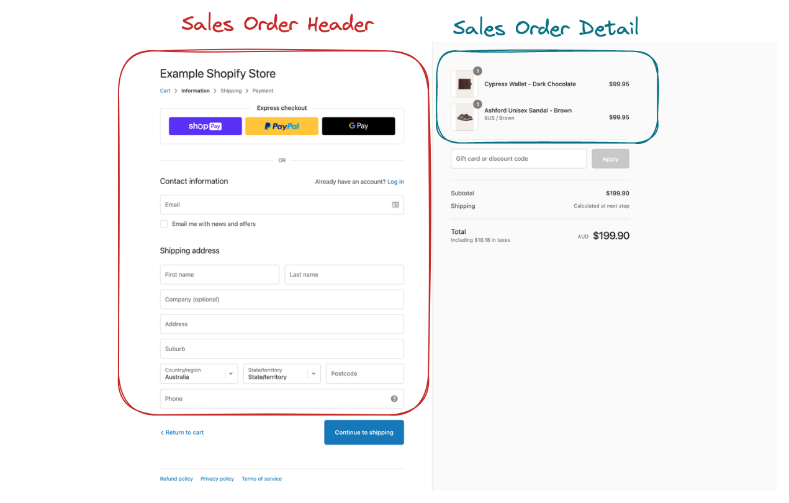

# Building a Kimball dimensional model with dbt <!-- omit in toc -->
[Building a Kimball dimensional model with dbt _ dbt Developer Blog](https://docs.getdbt.com/blog/kimball-dimensional-model) をやるよ。
画像は、一部を除いて全て原文から引用したものです。

# 目次 <!-- omit in toc -->
- [解説](#解説)
    - [はじめに](#はじめに)
    - [dimensional modeling とは](#dimensional-modeling-とは)
    - [準備](#準備)
    - [Part 1: Setup dbt project and database](#part-1-setup-dbt-project-and-database)
        - [Step 1: Before you get started](#step-1-before-you-get-started)
        - [Step 2: Clone the repository](#step-2-clone-the-repository)
        - [Step 3: Install dbt database adaptors](#step-3-install-dbt-database-adaptors)
        - [Step 4: Setup dbt profile](#step-4-setup-dbt-profile)
        - [Step 5: Install dbt dependencies](#step-5-install-dbt-dependencies)
        - [Step 6: Seed your database](#step-6-seed-your-database)
        - [Step 7: Examine the database source schema](#step-7-examine-the-database-source-schema)
        - [Step 8: Query the tables](#step-8-query-the-tables)
    - [Part 2: Identify the business process](#part-2-identify-the-business-process)
    - [Part 3: Identify the fact and dimension tables](#part-3-identify-the-fact-and-dimension-tables)
        - [Fact tables](#fact-tables)
        - [Dimension tables](#dimension-tables)
    - [Part 4: Create the dimension tables](#part-4-create-the-dimension-tables)
        - [Step 1: Create model files](#step-1-create-model-files)
        - [Step 2: Fetch data from the upstream tables](#step-2-fetch-data-from-the-upstream-tables)
        - [Step 3: Perform the joins](#step-3-perform-the-joins)
        - [Step 4: Create the surrogate key](#step-4-create-the-surrogate-key)
        - [Step 5: Select dimension table columns](#step-5-select-dimension-table-columns)
        - [Step 6: Choose a materialization type](#step-6-choose-a-materialization-type)
        - [Step 7: Create model documentation and tests](#step-7-create-model-documentation-and-tests)
        - [Step 8: Build dbt models](#step-8-build-dbt-models)
        - [Step おまけ: Other dimension tables](#step-おまけ-other-dimension-tables)
    - [Part 5: Create the fact table](#part-5-create-the-fact-table)
        - [Step 1: Create model files](#step-1-create-model-files-1)
        - [Step 2: Fetch data from the upstream tables](#step-2-fetch-data-from-the-upstream-tables-1)
        - [Step 3: Perform joins](#step-3-perform-joins)
        - [Step 4: Create the surrogate key](#step-4-create-the-surrogate-key-1)
        - [Step 5: Select fact table columns](#step-5-select-fact-table-columns)
        - [Step 6: Create foreign surrogate keys](#step-6-create-foreign-surrogate-keys)
        - [Step 7: Choose a materialization type](#step-7-choose-a-materialization-type)
        - [Step 8: Create model documentation and tests](#step-8-create-model-documentation-and-tests)
        - [Step 9: Build dbt models](#step-9-build-dbt-models)
    - [Part 6: Document the dimensional model relationships](#part-6-document-the-dimensional-model-relationships)
    - [Part 7: Consume dimensional model](#part-7-consume-dimensional-model)
- [Learning resources](#learning-resources)

# 解説
## はじめに
<!-- TODO dimensional modeling と書いたり ディ面書なるモデリングと書いたりしている 統一したい -->
dimensional modeling はデータモデリング手法（※）の一つで、分析用に最も広く採用されている手法です。
にもかかわらず、世の中には dbt を使って dimensional modeling を行うための資料が足りていません。。。つらいね。。。というわけで、このチュートリアルで dimensional modeling の決定版ガイドを提供したいと思います。

（※）その他のデータモデリング手法には、Data Vault (DV)、Third Normal Form (3NF)、One Big Table (OBT) などがあります。


このチュートリアルを完了すると、次のことができるようになります。

- dimensional modeling の概念を理解する
- モック dbt プロジェクトとデータベースをセットアップする
- モデル化するビジネス プロセスを特定する
- ファクト テーブルとディメンション テーブルを特定する
- ディメンション テーブルを作成する
- ファクト テーブルを作成する
- dimensional modeling のリレーションをドキュメント化する
- dimensional modeling を使用する

## dimensional modeling とは
dimensional modeling は、1996年にRalph Kimball氏が著書「The Data Warehouse Toolkit」で紹介した手法です。
dimensional modeling の目的は、raw データを、ビジネスを表現するファクトテーブルとディメンションテーブルに変換することです。

ディメンショナルモデリングのメリットを挙げます：

- 分析用のデータモデルがよりシンプルになる： 分析用にdimensional model を使用する際、ファクトテーブルとディメンションテーブル間の結合は、サロゲートキーを使用することで簡単に行うことができ、複雑な結合を行う必要がない
- Don’t repeat yourself[^1]：ディメンションは、他のファクトテーブルで簡単に再利用でき、労力とコード・ロジックの重複を避けることができます。再利用可能なディメンションは、[コンフォームド・ディメンション](https://www.kimballgroup.com/data-warehouse-business-intelligence-resources/kimball-techniques/dimensional-modeling-techniques/conformed-dimension/)と呼ばれます。
- データ検索の高速化： dimensional model に対して実行される分析クエリは、結合や集約などのデータ変換がすでに適用されているため、3NFモデルよりも大幅に高速です。
- 実際のビジネスプロセスとの密接な整合性：ビジネスプロセスとメトリクスは、dimensional model の一部としてモデル化され、計算される。これにより、モデル化されたデータが容易に利用できるようになる

[^1]: DRYとは、"Don't Repeat Yourself "の略で、ソフトウェア開発の原則の1つです。この原則に従うと、繰り返しのパターンや重複するコードやロジックを減らし、モジュール化された参照可能なコードにすることを目指すことになります。

さて、dimensional modeling の大まかな概念と利点を理解したところで、実際に dbt を使用して最初の dimensional model を作成してみましょう。

## 準備
実行環境は docker で作成します。Docker Desktop version 23.0.5 で動作確認しています。

## Part 1: Setup dbt project and database
### Step 1: Before you get started

これらを準備します：

- [DuckDB](https://duckdb.org/docs/installation/index) または [PostgreSQL](https://www.postgresql.org/download/) 
- Python 3.8 以上
- dbt 1.3.0 以上
- SQLの基本的な理解
- dbtの基本的な理解

はい、作りましょう。[^2]

[^2]: ここでは PostgreSQL を使用します

```
$ docker compose up -d --build

[+] Running 2/2
 - Container kimball-dimensional-model-dev_postgres-1  Started                                           1.2s
 - Container kimball-dimensional-model-dev_dbt-1       Started                                           1.3s
```

dbt コマンドの確認と、 PostgreSQL への疎通確認をします。

```
$ docker compose exec dev_dbt dbt debug
18:06:40  Running with dbt=1.5.0
18:06:40  dbt version: 1.5.0
18:06:40  python version: 3.11.2
18:06:40  python path: /usr/local/bin/python
18:06:40  os info: Linux-5.10.16.3-microsoft-standard-WSL2-x86_64-with-glibc2.31
18:06:40  Using profiles.yml file at /root/.dbt/profiles.yml
18:06:40  Using dbt_project.yml file at /usr/app/dbt/dbt_project.yml
18:06:40  Configuration:
18:06:40    profiles.yml file [OK found and valid]
18:06:40    dbt_project.yml file [ERROR not found]
18:06:40  Required dependencies:
18:06:40   - git [OK found]

18:06:40  Connection:
18:06:40    host: localhost
18:06:40    port: 5430
18:06:40    user: postgres
18:06:40    database: adventureworks
18:06:40    schema: dbo
18:06:40    search_path: None
18:06:40    keepalives_idle: 0
18:06:40    sslmode: None
18:06:40    Connection test: [OK connection ok]

18:06:40  1 check failed:
18:06:40  Could not load dbt_project.yml
```

`dbt_project.yml` はまだ作っていないので、これでOKです。

### Step 2: Clone the repository

ソースコードがあるリポジトリをcloneしましょう。

```
git clone https://github.com/Data-Engineer-Camp/dbt-dimensional-modelling.git
cd dbt-dimensional-modelling/adventureworks
```

<details>
<summary>実行例</summary>

```
root@docker-desktop:/usr/app/dbt# git clone https://github.com/Data-Engineer-Camp/dbt-dimensional-modelling.git
Cloning into 'dbt-dimensional-modelling'...
remote: Enumerating objects: 361, done.
remote: Counting objects: 100% (80/80), done.
remote: Compressing objects: 100% (16/16), done.
remote: Total 361 (delta 66), reused 64 (delta 64), pack-reused 281
Receiving objects: 100% (361/361), 4.55 MiB | 3.75 MiB/s, done.
Resolving deltas: 100% (176/176), done.
root@docker-desktop:/usr/app/dbt# cd dbt-dimensional-modelling/adventureworks
```

</details>

### Step 3: Install dbt database adaptors

インストール済み docker コンテナを立ち上げている（はず）なのでOK。

<details>
<summary>確認コマンド</summary>

```
$ docker compose exec dev_dbt pip freeze | grep dbt
dbt-core==1.5.0
dbt-extractor==0.4.1
dbt-postgres @ git+https://github.com/dbt-labs/dbt-core@dafb6aeb9338c3703f34cf2d0a79bd1ddca50d2f#subdirectory=plugins/postgres
```

</details>

### Step 4: Setup dbt profile

dbtプロファイル（`dbt-dimensional-modelling/adventureworks/profiles.yml` を参照）は、事前に設定済みです。
使用するデータベースの認証情報に合わせて、設定を確認・変更しましょう。

```yml
adventureworks:
  # target: duckdb
  target: postgres # postgresql を使うので変更
  outputs:
    duckdb:
     type: duckdb
     path: target/adventureworks.duckdb
     threads: 12
    postgres: # docker container 起動時の設定に合わせる。
      type: postgres
      host: localhost
      user: postgres
      # password: postgres
      password: "{{ env_var('POSTGRES_PASSWORD') }}"
      # port: 5432
      port: 5430 # 5430 -> 5432
      dbname: adventureworks # create this empty database beforehand 
      schema: dbo
      threads: 12
```

### Step 5: Install dbt dependencies

[`dbt_utils`](https://hub.getdbt.com/dbt-labs/dbt_utils/latest/) を使用するため、`dbt deps` でパッケージをインストールします：

```
dbt deps
```

（`dbt-dimensional-modelling/adventureworks/pachages.yml` を見ての通り、今回使用するのは `dbt_utils` のみです）

<details>
<summary>実行例</summary>

```
root@docker-desktop:/usr/app/dbt/dbt-dimensional-modelling/adventureworks# dbt deps
15:53:53  Running with dbt=1.5.0
15:53:53  Installing dbt-labs/dbt_utils
15:53:58  Installed from version 1.0.0
15:53:58  Updated version available: 1.1.0
15:53:58
15:53:58  Updates available for packages: ['dbt-labs/dbt_utils']
Update your versions in packages.yml, then run dbt deps
```

（実行日（2023/5/30）時点で、dbt_utils 1.1.0 が出ているみたいですが、一旦このまま進めます）

</details>

### Step 6: Seed your database

[dbt seeds](https://docs.getdbt.com/docs/build/seeds) を使用して、今回使用する AdventureWorks （`dbt-dimensional-modelling/adventureworks/seeds/*` を参照）データを、使用するデータベースに追加していきます：

```
# seed duckdb # 今回は実行しないよ
# dbt seed --target duckdb

# seed postgres
dbt seed --target postgres
```

<details>
<summary>実行例</summary>

```
root@docker-desktop:/usr/app/dbt/dbt-dimensional-modelling/adventureworks# dbt seed --target postgres
16:14:16  Running with dbt=1.5.0
16:14:17  Unable to do partial parsing because profile has changed
16:14:17  Unable to do partial parsing because env vars used in profiles.yml have changed
16:14:20  Found 8 models, 42 tests, 0 snapshots, 0 analyses, 420 macros, 0 operations, 15 seed files, 0 sources, 0 exposures, 0 metrics, 0 groups
16:14:20
16:14:20  Concurrency: 12 threads (target='postgres')
16:14:20
16:14:20  1 of 15 START seed file person.address ......................................... [RUN]
16:14:20  2 of 15 START seed file person.countryregion ................................... [RUN]
16:14:20  3 of 15 START seed file sales.creditcard ....................................... [RUN]
16:14:20  4 of 15 START seed file sales.customer ......................................... [RUN]
16:14:20  5 of 15 START seed file date.date .............................................. [RUN]
16:14:20  6 of 15 START seed file person.person .......................................... [RUN]
16:14:20  7 of 15 START seed file production.product ..................................... [RUN]
16:14:20  8 of 15 START seed file production.productcategory ............................. [RUN]
16:14:20  9 of 15 START seed file production.productsubcategory .......................... [RUN]
16:14:20  10 of 15 START seed file sales.salesorderdetail ................................ [RUN]
16:14:20  11 of 15 START seed file sales.salesorderheader ................................ [RUN]
16:14:20  12 of 15 START seed file sales.salesorderheadersalesreason ..................... [RUN]
16:14:25  9 of 15 OK loaded seed file production.productsubcategory ...................... [INSERT 37 in 4.71s]
16:14:26  8 of 15 OK loaded seed file production.productcategory ......................... [INSERT 4 in 5.02s]
16:14:26  2 of 15 OK loaded seed file person.countryregion ............................... [INSERT 238 in 5.32s]
16:14:27  13 of 15 START seed file sales.salesreason ..................................... [RUN]
16:14:27  14 of 15 START seed file person.stateprovince .................................. [RUN]
16:14:27  15 of 15 START seed file sales.store ........................................... [RUN]
16:14:35  12 of 15 OK loaded seed file sales.salesorderheadersalesreason ................. [INSERT 1710 in 14.10s]
16:14:36  5 of 15 OK loaded seed file date.date .......................................... [INSERT 731 in 15.85s]
16:14:38  13 of 15 OK loaded seed file sales.salesreason ................................. [INSERT 10 in 10.89s]
16:14:40  14 of 15 OK loaded seed file person.stateprovince .............................. [INSERT 181 in 12.39s]
16:14:40  7 of 15 OK loaded seed file production.product ................................. [INSERT 504 in 20.03s]
16:14:41  15 of 15 OK loaded seed file sales.store ....................................... [INSERT 701 in 13.63s]
16:14:44  1 of 15 OK loaded seed file person.address ..................................... [INSERT 1675 in 23.38s]
16:14:50  6 of 15 OK loaded seed file person.person ...................................... [INSERT 2057 in 29.72s]
16:14:59  11 of 15 OK loaded seed file sales.salesorderheader ............................ [INSERT 1566 in 39.10s]
16:15:06  10 of 15 OK loaded seed file sales.salesorderdetail ............................ [INSERT 5716 in 46.04s]
16:15:15  4 of 15 OK loaded seed file sales.customer ..................................... [INSERT 19820 in 54.59s]
16:15:21  3 of 15 OK loaded seed file sales.creditcard ................................... [INSERT 19118 in 60.93s]
16:15:21
16:15:21  Finished running 15 seeds in 0 hours 1 minutes and 1.31 seconds (61.31s).
16:15:21
16:15:21  Completed successfully
16:15:21
16:15:21  Done. PASS=15 WARN=0 ERROR=0 SKIP=0 TOTAL=15
```

</details>


### Step 7: Examine the database source schema

ビジネスで生み出されたすべてのデータは、OLTP データベースに保存されています。
今回扱うビジネスデータについて、データベースのERD（Entity Relationship Diagram、ER図）を掲載します。
次のデータベースソーススキーマに注目しながら調べてみましょう：

- テーブル
- キー
- リレーション


### Step 8: Query the tables

クエリを発行して、レコードを見てみることで、より理解が深まるでしょう。例えば、次のクエリを実行してみます：

```sql
select * from sales.salesorderheader limit 10; 
```

`output`

```sql
 salesorderid | shipmethodid | billtoaddressid |    modifieddate     |               rowguid                |  taxamt   | shiptoaddressid | onlineorderflag | territoryid | status |      orderdate      | creditcardapprovalcode |  subtotal  | creditcardid | currencyrateid | revisionnumber |  freight  |       duedate       |  totaldue  | customerid | salespersonid |      shipdate       | accountnumber
--------------+--------------+-----------------+---------------------+--------------------------------------+-----------+-----------------+-----------------+-------------+--------+---------------------+------------------------+------------+--------------+----------------+----------------+-----------+---------------------+------------+------------+---------------+---------------------+----------------
        43659 |            5 |             985 | 2011-06-07 00:00:00 | 79b65321-39ca-4115-9cba-8fe0903e12e6 | 1971.5149 |             985 | f               |           5 |      5 | 2011-05-31 00:00:00 | 105041Vi84182          | 20565.6206 |        16281 |                |              8 |  616.0984 | 2011-06-12 00:00:00 | 23153.2339 |      29825 |           279 | 2011-06-07 00:00:00 | 10-4020-000676
        43660 |            5 |             921 | 2011-06-07 00:00:00 | 738dc42d-d03b-48a1-9822-f95a67ea7389 |  124.2483 |             921 | f               |           5 |      5 | 2011-05-31 00:00:00 | 115213Vi29411          |  1294.2529 |         5618 |                |              8 |   38.8276 | 2011-06-12 00:00:00 |  1457.3288 |      29672 |           279 | 2011-06-07 00:00:00 | 10-4020-000117
        43661 |            5 |             517 | 2011-06-07 00:00:00 | d91b9131-18a4-4a11-bc3a-90b6f53e9d74 | 3153.7696 |             517 | f               |           6 |      5 | 2011-05-31 00:00:00 | 85274Vi6854            | 32726.4786 |         1346 |              4 |              8 |   985.553 | 2011-06-12 00:00:00 | 36865.8012 |      29734 |           282 | 2011-06-07 00:00:00 | 10-4020-000442
        43662 |            5 |             482 | 2011-06-07 00:00:00 | 4a1ecfc0-cc3a-4740-b028-1c50bb48711c | 2775.1646 |             482 | f               |           6 |      5 | 2011-05-31 00:00:00 | 125295Vi53935          | 28832.5289 |        10456 |              4 |              8 |  867.2389 | 2011-06-12 00:00:00 | 32474.9324 |      29994 |           282 | 2011-06-07 00:00:00 | 10-4020-000227
        43663 |            5 |            1073 | 2011-06-07 00:00:00 | 9b1e7a40-6ae0-4ad3-811c-a64951857c4b |   40.2681 |            1073 | f               |           4 |      5 | 2011-05-31 00:00:00 | 45303Vi22691           |   419.4589 |         4322 |                |              8 |   12.5838 | 2011-06-12 00:00:00 |   472.3108 |      29565 |           276 | 2011-06-07 00:00:00 | 10-4020-000510
        43664 |            5 |             876 | 2011-06-07 00:00:00 | 22a8a5da-8c22-42ad-9241-839489b6ef0d | 2344.9921 |             876 | f               |           1 |      5 | 2011-05-31 00:00:00 | 95555Vi4081            | 24432.6088 |          806 |                |              8 |    732.81 | 2011-06-12 00:00:00 | 27510.4109 |      29898 |           280 | 2011-06-07 00:00:00 | 10-4020-000397
        43665 |            5 |             849 | 2011-06-07 00:00:00 | 5602c304-853c-43d7-9e79-76e320d476cf | 1375.9427 |             849 | f               |           1 |      5 | 2011-05-31 00:00:00 | 35568Vi78804           | 14352.7713 |        15232 |                |              8 |  429.9821 | 2011-06-12 00:00:00 | 16158.6961 |      29580 |           283 | 2011-06-07 00:00:00 | 10-4020-000146
        43666 |            5 |            1074 | 2011-06-07 00:00:00 | e2a90057-1366-4487-8a7e-8085845ff770 |  486.3747 |            1074 | f               |           4 |      5 | 2011-05-31 00:00:00 | 105623Vi69217          |  5056.4896 |        13349 |                |              8 |  151.9921 | 2011-06-12 00:00:00 |  5694.8564 |      30052 |           276 | 2011-06-07 00:00:00 | 10-4020-000514
```

<!-- TODO めんどくさいので一気に pandas profiling とか実行するやつほしいね -->


dbt プロジェクトとデータベースのセットアップが完了したら、次は dimension model に必要なテーブルを特定するパートに移ります。

## Part 2: Identify the business process

dbt プロジェクト、データベースのセットアップが完了し、スキーマを覗き見たところで、いよいよビジネスプロセスの特定に入ります。
ビジネスプロセスの特定は、ビジネスユーザーとの共同作業で行われます。ビジネスユーザーは、ビジネス目標やビジネスプロセスに関するコンテキストを持っており、その情報をあなたに教えることができます。

あなたは、AdventureWorks の CEOと会話して、次の情報を得ました：

> AdventureWorksは自転車を製造し、消費者（B2C）および企業（B2B）に販売しています。
> 自転車は世界中の顧客に発送されています。
> この事業のCEOとして、以下の切り口で、2011年末までの年間売上高を把握したいと考えています：
> 
> - 製品カテゴリーとサブカテゴリー
> - 顧客
> - 注文状況
> - 配送先の国、州、都市

ビジネスユーザーから提供された情報に基づいて、あなたは問題のビジネスプロセスが「販売」プロセスであることを特定しました。
次のパートでは、販売プロセスの dimensional model を設計します。

## Part 3: Identify the fact and dimension tables 

前編で提供された情報をもとに、AdventureWorks のビジネスにおける販売プロセスを表現する dimensional model を作成し、さらに次の条件でデータを slice and dice できるようにしましょう：

- 製品カテゴリーとサブカテゴリー
- 顧客
- 注文状況
- 配送先の国、州、都市
- 日付（年、月、日）

### Fact tables 

> **Note**
> 
> ファクトテーブルとは、現実世界におけるビジネスプロセスを表すテーブルのことです。
> ファクトテーブルの例としては、次のようなビジネスイベントを表しています：
> 
> - 商品販売
> - ウェブサイトのクリック
> - 生産指示票[^3]

[^3]: https://ejje.weblio.jp/content/production+work+order より。いまいちピンとこない。。。

さて、販売スキーマには、注目すべき2つのテーブルがあります。この2つのテーブルは、販売プロセスのファクトテーブルを作成するために使用できます：

- `sales.salesorderheader` テーブルには、注文で使用されたクレジットカード、配送先住所、および顧客に関する情報が含まれています。このテーブルの各レコードは、1つまたは複数の注文の詳細を含む注文ヘッダを表します。
- `sales.salesorderdetail` テーブルには、注文された商品に関する情報、注文数量と単価が含まれており、これを利用して収益を算出することができます。このテーブルの各レコードは、1つの注文明細を表します。



`sales.salesorderheader` と `sales.salesorderdetail` を結合する `fct_sales` というファクトテーブルを定義しましょう。
ファクトテーブルの各レコード (グレイン（grain、粒を意味する）とも呼ばれる) は、注文の詳細です。


### Dimension tables

> **Note**
> ディメンションテーブルは、ビジネス・プロセス・イベントに関する文脈上の情報、または記述的な情報を表すために使用されます。
> ディメンションの例を挙げると、以下があります：
> 
> - 顧客の詳細：ある注文番号はどの顧客のものですか？
> - ウェブサイトでのクリック位置の詳細： ユーザーがクリックしたのはどのボタンですか？
> - 商品の詳細： カートに追加された商品の詳細は？

ビジネスユーザーが答えを得たいビジネス上の質問に基づき、ビジネスプロセスに役立つコンテキスト情報を含むいくつかのテーブルを特定することができます：

- `person.address`
- `person.countryregion`
- `production.product`
- `production.productcategory`
- `sales.customer`
- `sales.store`
- など …

ディメンションテーブルを作成する方法はさまざまです。下図に示すように、既存のリレーションシップを使用することができます。


このように、ファクトテーブルと結合するディメンションテーブルが、さらにいくつかの（正規化された）ディメンションテーブルと結合するスキーマは「スノーフレークスキーマ」として知られています。
しかしながら、このモデルでは、dimensional model の利用者は多数の結合を行う必要があります。

その代わりに、結合することでディメンションテーブルを非正規化します。


これは「スタースキーマ」として知られており、このアプローチにより、dimensional model の利用者が行う必要がある結合を減らすことができます。
スタースキーマのアプローチを使用して、次のように、ビジネス上の質問に答えるのに役立つ6つのディメンションを特定することができます：

- `im_product` : 製品、製品サブカテゴリ、製品カテゴリを結合したディメンションテーブル
- `dim_address` : 住所、州、国、地域を結合したディメンションテーブル
- `dim_customer` : 顧客、個人、店舗を結合したディメンションテーブル
- `dim_credit_card` : `creditcard` から作成したディメンションテーブル
- `dim_order_status` : `salesorderheader` から distinct status をとって作成したディメンションテーブル
- `dim_date` : [dbt_date](https://hub.getdbt.com/calogica/dbt_date/latest/) パッケージを使用して生成された、日付属性を含むディメンションテーブル
    - 実行日（2023/5/30）時点で、[dbt_date は DuckDB をサポートしていない](https://hub.getdbt.com/calogica/dbt_date/latest/#:~:text=This%20package%20supports%3A)ので注意

<details>
<summary>リネージ</summary>


</details>

次のパートでは、dbt を使用して、ここで洗い出したファクトテーブルとディメンションテーブルを作成します。

## Part 4: Create the dimension tables

まず、製品カテゴリのディメンションテーブル `dim_product` を作成しましょう。他のディメンションテーブルも、これから説明するのと同じ手順で作成します。

### Step 1: Create model files

変換コードを格納する新しい dbt モデルファイルを作成しましょう。`dbt-dimensional-modelling/adventureworks/models/marts/` の下に、2つのファイルを作成します（サンプルコードリポジトリに用意されているので、手書き不要です）：

- `dim_product.sql` : このファイルには、SQL変換コードが含まれます。
- `dim_product.yml` : このファイルには、`dim_product` のドキュメントとテストが含まれます。

```
dbt-dimensional-modelling/adventureworks/models/
└── marts
    ├── dim_product.sql
    ├── dim_product.yml
```

### Step 2: Fetch data from the upstream tables

`dbt-dimensional-modelling/amodels/marts/dim_product.sql` では、Common Table Expressions（CTE）を使って、上流のテーブルからデータを選択します。

```sql
with stg_product as (
    select *
    from {{ ref('product') }}
),

stg_product_subcategory as (
    select *
    from {{ ref('productsubcategory') }}
),

stg_product_category as (
    select *
    from {{ ref('productcategory') }}
)

... 
```

[`ref()`](https://docs.getdbt.com/reference/dbt-jinja-functions/ref) 関数で上流のテーブルを参照し、依存関係のDAG（Directed Acyclic Graph）を作成します。
<!-- （`ref()` で指定するモデルはどこから来たの、と思ったときは seeds を見よう？あってんのかな） -->

### Step 3: Perform the joins

`dim_product.sql` の次の段では、適切な結合キーを使用して、CTE テーブル間の結合を実行します。

```sql
... 
select
    {{ dbt_utils.generate_surrogate_key(['stg_product.productid']) }} as product_key,
    ...

from stg_product
left join stg_product_subcategory on stg_product.productsubcategoryid = stg_product_subcategory.productsubcategoryid
left join stg_product_category on stg_product_subcategory.productcategoryid = stg_product_category.productcategoryid
```

`generate_surrogate_key()` の説明は、次のステップで。

### Step 4: Create the surrogate key

> **Note**
> [Surrogate key](https://www.kimballgroup.com/1998/05/surrogate-keys/)は、ディメンションモデルの利用者に、ファクトテーブルとディメンションテーブルを結合するための使いやすいキーを提供するためのものです。
> 基盤となるビジネス・コンテキストを理解せずとも、サロゲートキーを合わせることだけ考えれば、テーブルを結合できます。

サロゲートキーを作成するには、いくつかのアプローチがあります：

- Hashing surrogate key：テーブルの一意なキーをハッシュすることで構築されるサロゲートキー（例： `md5(key_1, key_2, key_3)` ）
- Incrementing surrogate key：常にインクリメントされる数値を使用して構築されるサロゲートキー（例：`row_number()`）
- Concatenating surrogate key：固有キーのカラムを連結して作成するサロゲートキー (例: `concat(key_1, key_2, key_3)` )

ここでは、ディメンションテーブルで一意なキー列に対してハッシュを実行するという、間違いなく最も簡単なアプローチを使用します。この方法は、後でファクトテーブルの Surrogate key を生成する際に、ディメンションテーブルとの結合を実行する手間を省くことができます。
Surrogate key を生成するには、dbt_utils パッケージで提供されている [generate_surrogate_key()](https://docs.getdbt.com/blog/sql-surrogate-keys) という dbt マクロを使用します。このマクロは、データベースの適切なハッシュ関数を使用して、列のリストからサロゲートキーを生成します (例: `md5()`、`hash()`等)。

### Step 5: Select dimension table columns

ディメンションテーブルの列を選択して、後でファクトテーブルと組み合わせて使用できるようにします。ここでは、先に特定したビジネス上の質問に答えるのに役立つ列を選択します。

```sql
...
select
    {{ dbt_utils.generate_surrogate_key(['stg_product.productid']) }} as product_key,
    stg_product.productid,
    stg_product.name as product_name,
    stg_product.productnumber,
    stg_product.color,
    stg_product.class,
    stg_product_subcategory.name as product_subcategory_name,
    stg_product_category.name as product_category_name
from stg_product
left join stg_product_subcategory on stg_product.productsubcategoryid = stg_product_subcategory.productsubcategoryid
left join stg_product_category on stg_product_subcategory.productcategoryid = stg_product_category.productcategoryid
```

これで、製品カテゴリのディメンションテーブル `dim_product` を集計するクエリは完成です！
（サロゲートキーをくっつけただけですけどね、正規化されたテーブルがソースだとあるある）

### Step 6: Choose a materialization type

モデルを実体化する方針を[マテリアライズ](https://docs.getdbt.com/docs/build/materializations)といいます。
dbt がサポートする以下のマテリアライゼーションタイプの中から選択します[^4]：

[^4]: Efemeral はテーブル/ビューを作成するものでなく、CTE を定義するものなので、選択しない

- View
- Table
- Incremental

通常、ディメンションテーブルのデータ量はそれほど大きくないため、ディメンションテーブルはテーブルまたはビューとして実体化するのが一般的です。
この例ではテーブルに実体化します。`dbt-dimensional-modelling/adventureworks/dbt_project.yml` で `marts` スキーマにある全てのディメンションモデルに対して、マテリアライゼーションタイプをテーブルとします。

```yml
models:
  adventureworks:
    marts:
      +materialized: table
      +schema: marts
```

### Step 7: Create model documentation and tests

`dim_product.sql` モデルと一緒に、対応する `dim_product.yml` ファイルを入力して、モデルを文書化してテストすることができます。ここでは、サロゲートキーが unique か、製品IDや製品名が null でないか、をチェックさせます。
サンプルコード `dbt-dimensional-modelling/adventureworks/models/marts/dim_product.yml` をご参照ください。

```yml
version: 2

models:
  - name: dim_product
    columns:
      - name: product_key 
        description: The surrogate key of the product
        tests:
          - not_null
          - unique
      - name: productid 
        description: The natural key of the product
        tests:
          - not_null
          - unique
      - name: product_name 
        description: The product name
        tests:
          - not_null
```

### Step 8: Build dbt models

`dbt run` と `dbt test` コマンドを実行すると、dbt モデルの実行とモデルのテストができます：

```
dbt run && dbt test 
```

（`dbt-dimensional-modeling` リポジトリのソースを丸ごと持ってきている場合、ここで `dbt run` すると他のテーブルもできてしまうので、`dim_product` だけ実行する。残りは次のパートで。。。）

<details>
<summary>出力例</summary>

まずはモデルを run 

```
$ dbt run --select dim_product
```

`result`

```log
09:43:05  Running with dbt=1.5.0
09:43:05  Unable to do partial parsing because config vars, config profile, or config target have changed
09:43:08  Found 8 models, 42 tests, 0 snapshots, 0 analyses, 420 macros, 0 operations, 15 seed files, 0 sources, 0 exposures, 0 metrics, 0 groups
09:43:08
09:43:09  Concurrency: 12 threads (target='postgres')
09:43:09
09:43:09  1 of 1 START sql table model marts.dim_product ................................. [RUN]
09:43:09  1 of 1 OK created sql table model marts.dim_product ............................ [SELECT 504 in 0.15s]
09:43:09
09:43:09  Finished running 1 table model in 0 hours 0 minutes and 0.31 seconds (0.31s).
09:43:09
09:43:09  Completed successfully
09:43:09
09:43:09  Done. PASS=1 WARN=0 ERROR=0 SKIP=0 TOTAL=1
```

テストを実行。

```
$ dbt test --select dim_product
```

`result`

```log
10:05:53  Running with dbt=1.5.0
10:05:55  Found 8 models, 42 tests, 0 snapshots, 0 analyses, 420 macros, 0 operations, 15 seed files, 0 sources, 0 exposures, 0 metrics, 0 groups
10:05:55
10:05:55  Concurrency: 12 threads (target='postgres')
10:05:55
10:05:56  1 of 5 START test not_null_dim_product_product_key ............................. [RUN]
10:05:56  2 of 5 START test not_null_dim_product_product_name ............................ [RUN]
10:05:56  3 of 5 START test not_null_dim_product_productid ............................... [RUN]
10:05:56  4 of 5 START test unique_dim_product_product_key ............................... [RUN]
10:05:56  5 of 5 START test unique_dim_product_productid ................................. [RUN]
10:05:56  4 of 5 PASS unique_dim_product_product_key ..................................... [PASS in 0.12s]
10:05:56  2 of 5 PASS not_null_dim_product_product_name .................................. [PASS in 0.14s]
10:05:56  1 of 5 PASS not_null_dim_product_product_key ................................... [PASS in 0.14s]
10:05:56  3 of 5 PASS not_null_dim_product_productid ..................................... [PASS in 0.14s]
10:05:56  5 of 5 PASS unique_dim_product_productid ....................................... [PASS in 0.14s]
10:05:56
10:05:56  Finished running 5 tests in 0 hours 0 minutes and 0.30 seconds (0.30s).
10:05:56
10:05:56  Completed successfully
10:05:56
10:05:56  Done. PASS=5 WARN=0 ERROR=0 SKIP=0 TOTAL=5
```

</details>

これで、ディメンションテーブルを作成するためのすべてのステップが完了しました。
あとは、先に確認したすべてのディメンションテーブルに対して同じ手順の繰り返しです。
次のパートに進む前に、すべてのディメンジョンテーブルを作成することを確認してください。

### Step おまけ: Other dimension tables

残りのディメンションテーブルで行っている処理を見ていきましょう。

> `dim_address` : 住所、州、国、地域を結合したディメンションテーブル

住所、州、国、地域 を抽出してサロゲートキーを付ける。特段変わった処理はしていない。

> `dim_customer` : 顧客、個人、店舗を結合したディメンションテーブル

顧客のファーストネーム、ミドルネーム、ラストネームを結合して、フルネームを作成している。他には特段変わった処理はない。

```sql
...
stg_person as (
    select
        businessentityid,
        concat(coalesce(firstname, ''), ' ', coalesce(middlename, ''), ' ', coalesce(lastname, '')) as fullname
    from {{ ref('person') }}
),
...
```

> `dim_credit_card` : `creditcard` から作成したディメンションテーブル

クレジットカードIDで distinct したやつ。特段変わった処理はしていない。

> `dim_order_status` : `salesorderheader` から distinct status をとって作成したディメンションテーブル

注文ステータス（番号）にそれぞれ名前を付けている。名前のほうが格段にわかりやすい。

```sql
...
select
    {{ dbt_utils.generate_surrogate_key(['stg_order_status.order_status']) }} as order_status_key,
    order_status,
    case
        when order_status = 1 then 'in_process'
        when order_status = 2 then 'approved'
        when order_status = 3 then 'backordered'
        when order_status = 4 then 'rejected'
        when order_status = 5 then 'shipped'
        when order_status = 6 then 'cancelled'
        else 'no_status'
    end as order_status_name
from stg_order_status
```

> `dim_date` : [dbt_date](https://hub.getdbt.com/calogica/dbt_date/latest/) パッケージを使用して生成された、日

特段変わった処理はしていない。

ひととおり眺めたところで、すべてのディメンションテーブルに対して `dbt run` を実行します。

```
dbt run --select "marts.dim_*"
```

<details>
<summary>run 出力例</summary>

```log
10:28:33  Running with dbt=1.5.0
10:28:35  Found 8 models, 42 tests, 0 snapshots, 0 analyses, 420 macros, 0 operations, 15 seed files, 0 sources, 0 exposures, 0 metrics, 0 groups
10:28:35
10:28:35  Concurrency: 12 threads (target='postgres')
10:28:35
10:28:35  1 of 6 START sql table model marts.dim_address ................................. [RUN]
10:28:35  2 of 6 START sql table model marts.dim_credit_card ............................. [RUN]
10:28:35  3 of 6 START sql table model marts.dim_customer ................................ [RUN]
10:28:35  4 of 6 START sql table model marts.dim_date .................................... [RUN]
10:28:35  5 of 6 START sql table model marts.dim_order_status ............................ [RUN]
10:28:35  6 of 6 START sql table model marts.dim_product ................................. [RUN]
10:28:35  1 of 6 OK created sql table model marts.dim_address ............................ [SELECT 1675 in 0.32s]
10:28:35  6 of 6 OK created sql table model marts.dim_product ............................ [SELECT 504 in 0.32s]
10:28:35  2 of 6 OK created sql table model marts.dim_credit_card ........................ [SELECT 1316 in 0.32s]
10:28:35  4 of 6 OK created sql table model marts.dim_date ............................... [SELECT 731 in 0.32s]
10:28:35  5 of 6 OK created sql table model marts.dim_order_status ....................... [SELECT 1 in 0.33s]
10:28:35  3 of 6 OK created sql table model marts.dim_customer ........................... [SELECT 19820 in 0.34s]
10:28:35
10:28:35  Finished running 6 table models in 0 hours 0 minutes and 0.52 seconds (0.52s).
10:28:35
10:28:35  Completed successfully
10:28:35
10:28:35  Done. PASS=6 WARN=0 ERROR=0 SKIP=0 TOTAL=6
```

</details>

```
dbt test --select "marts.dim_*"
```

<details>
<summary>test 出力例</summary>

```log
11:28:59  Running with dbt=1.5.0
11:29:01  Found 8 models, 42 tests, 0 snapshots, 0 analyses, 420 macros, 0 operations, 15 seed files, 0 sources, 0 exposures, 0 metrics, 0 groups
11:29:01
11:29:02  Concurrency: 12 threads (target='postgres')
11:29:02
11:29:02  1 of 25 START test not_null_dim_address_address_key ............................ [RUN]
11:29:02  2 of 25 START test not_null_dim_address_addressid .............................. [RUN]
11:29:02  3 of 25 START test not_null_dim_credit_card_cardtype ........................... [RUN]
11:29:02  4 of 25 START test not_null_dim_credit_card_creditcard_key ..................... [RUN]
11:29:02  5 of 25 START test not_null_dim_credit_card_creditcardid ....................... [RUN]
11:29:02  6 of 25 START test not_null_dim_customer_customer_key .......................... [RUN]
11:29:02  7 of 25 START test not_null_dim_customer_customerid ............................ [RUN]
11:29:02  8 of 25 START test not_null_dim_date_date_day .................................. [RUN]
11:29:02  9 of 25 START test not_null_dim_date_date_key .................................. [RUN]
11:29:02  10 of 25 START test not_null_dim_order_status_order_status ..................... [RUN]
11:29:02  11 of 25 START test not_null_dim_order_status_order_status_key ................. [RUN]
11:29:02  12 of 25 START test not_null_dim_product_product_key ........................... [RUN]
11:29:02  1 of 25 PASS not_null_dim_address_address_key .................................. [PASS in 0.31s]
11:29:02  4 of 25 PASS not_null_dim_credit_card_creditcard_key ........................... [PASS in 0.30s]
11:29:02  2 of 25 PASS not_null_dim_address_addressid .................................... [PASS in 0.30s]
11:29:02  5 of 25 PASS not_null_dim_credit_card_creditcardid ............................. [PASS in 0.30s]
11:29:02  3 of 25 PASS not_null_dim_credit_card_cardtype ................................. [PASS in 0.31s]
11:29:02  6 of 25 PASS not_null_dim_customer_customer_key ................................ [PASS in 0.30s]
11:29:02  7 of 25 PASS not_null_dim_customer_customerid .................................. [PASS in 0.30s]
11:29:02  9 of 25 PASS not_null_dim_date_date_key ........................................ [PASS in 0.30s]
11:29:02  8 of 25 PASS not_null_dim_date_date_day ........................................ [PASS in 0.31s]
11:29:02  10 of 25 PASS not_null_dim_order_status_order_status ........................... [PASS in 0.30s]
11:29:02  11 of 25 PASS not_null_dim_order_status_order_status_key ....................... [PASS in 0.30s]
11:29:02  12 of 25 PASS not_null_dim_product_product_key ................................. [PASS in 0.31s]
11:29:02  13 of 25 START test not_null_dim_product_product_name .......................... [RUN]
11:29:02  14 of 25 START test not_null_dim_product_productid ............................. [RUN]
11:29:02  15 of 25 START test unique_dim_address_address_key ............................. [RUN]
11:29:02  16 of 25 START test unique_dim_address_addressid ............................... [RUN]
11:29:02  17 of 25 START test unique_dim_credit_card_creditcardid ........................ [RUN]
11:29:02  18 of 25 START test unique_dim_customer_customer_key ........................... [RUN]
11:29:02  19 of 25 START test unique_dim_customer_customerid ............................. [RUN]
11:29:02  20 of 25 START test unique_dim_date_date_day ................................... [RUN]
11:29:02  21 of 25 START test unique_dim_date_date_key ................................... [RUN]
11:29:02  22 of 25 START test unique_dim_order_status_order_status ....................... [RUN]
11:29:02  23 of 25 START test unique_dim_order_status_order_status_key ................... [RUN]
11:29:02  24 of 25 START test unique_dim_product_product_key ............................. [RUN]
11:29:02  13 of 25 PASS not_null_dim_product_product_name ................................ [PASS in 0.28s]
11:29:02  14 of 25 PASS not_null_dim_product_productid ................................... [PASS in 0.28s]
11:29:02  15 of 25 PASS unique_dim_address_address_key ................................... [PASS in 0.28s]
11:29:02  17 of 25 PASS unique_dim_credit_card_creditcardid .............................. [PASS in 0.28s]
11:29:02  16 of 25 PASS unique_dim_address_addressid ..................................... [PASS in 0.28s]
11:29:02  19 of 25 PASS unique_dim_customer_customerid ................................... [PASS in 0.28s]
11:29:02  20 of 25 PASS unique_dim_date_date_day ......................................... [PASS in 0.28s]
11:29:02  18 of 25 PASS unique_dim_customer_customer_key ................................. [PASS in 0.29s]
11:29:02  21 of 25 PASS unique_dim_date_date_key ......................................... [PASS in 0.28s]
11:29:02  22 of 25 PASS unique_dim_order_status_order_status ............................. [PASS in 0.28s]
11:29:02  23 of 25 PASS unique_dim_order_status_order_status_key ......................... [PASS in 0.28s]
11:29:02  24 of 25 PASS unique_dim_product_product_key ................................... [PASS in 0.29s]
11:29:02  25 of 25 START test unique_dim_product_productid ............................... [RUN]
11:29:02  25 of 25 PASS unique_dim_product_productid ..................................... [PASS in 0.05s]
11:29:02
11:29:02  Finished running 25 tests in 0 hours 0 minutes and 0.97 seconds (0.97s).
11:29:02
11:29:02  Completed successfully
11:29:02
11:29:02  Done. PASS=25 WARN=0 ERROR=0 SKIP=0 TOTAL=25
```

</details>

## Part 5: Create the fact table

ディメンションテーブルをすべて作成したら、次はファクトテーブル  `fct_sales`  を作成します。

### Step 1: Create model files

変換コードを格納する新しいdbtモデル・ファイルを作成しましょう。`dbt-dimensional-modelling/aventureworks/models/marts/` の下に、2つのファイルを作成します（こちらもサンプルコードリポジトリに用意されているので、手書き不要）：

- `fct_sales.sql` : このファイルには、SQL変換コードが格納されます。
- `fct_sales.yml` : このファイルには、`fct_sales` のドキュメントとテストが含まれます。

```
dbt-dimensional-modelling/adventureworks/models/
└── marts
    ├── fct_sales.sql
    ├── fct_sales.yml
```

### Step 2: Fetch data from the upstream tables

ビジネス上の質問に答えるには、`salesorderheader` と `salesorderdetail` の両方のカラムが必要です。それを`fct_sales.sql` に反映させましょう：

```sql
with stg_salesorderheader as (
    select
        salesorderid,
        customerid,
        creditcardid,
        shiptoaddressid,
        status as order_status,
        cast(orderdate as date) as orderdate
    from {{ ref('salesorderheader') }}
),

stg_salesorderdetail as (
    select
        salesorderid,
        salesorderdetailid,
        productid,
        orderqty,
        unitprice,
        unitprice * orderqty as revenue
    from {{ ref('salesorderdetail') }}
)

... 
```

### Step 3: Perform joins

`fct_sales` テーブルのグレインは、`salesorderdetail` テーブルの1レコードです。1レコードに `salesorderheader` 内での商品の数量も記述したいので、その粒度を実現するために、`salesorderheader` と `salesorderdetail` の間で join を行います。

```sql
... 

select
    ... 
from stg_salesorderdetail
inner join stg_salesorderheader on stg_salesorderdetail.salesorderid = stg_salesorderheader.salesorderid
```

### Step 4: Create the surrogate key

次に、ファクトテーブルの各行を一意に識別するためのサロゲートキーを作成します。`fct_sales` テーブルの各行は、`salesorderid` と `salesorderdetailid` によって一意に識別できます。このため、`generate_surrogate_key()` マクロで両方のカラムを使用します。

```sql
...

select
    {{ dbt_utils.generate_surrogate_key(['stg_salesorderdetail.salesorderid', 'salesorderdetailid']) }} as sales_key,
    ...
from stg_salesorderdetail
inner join stg_salesorderheader on stg_salesorderdetail.salesorderid = stg_salesorderheader.salesorderid
```

### Step 5: Select fact table columns

これで、先に特定したビジネス上の質問に答えるのに役立つファクトテーブル列を選択できます。収益の金額を計算できるようにしたいので、`unitprice * orderqty as revenue` で収益を算出し、販売注文詳細ごとの収益列を追加します。

```sql
...

select
    {{ dbt_utils.generate_surrogate_key(['stg_salesorderdetail.salesorderid', 'salesorderdetailid']) }} as sales_key,
    stg_salesorderdetail.salesorderid,
    stg_salesorderdetail.salesorderdetailid,
    stg_salesorderdetail.unitprice,
    stg_salesorderdetail.orderqty,
    stg_salesorderdetail.revenue
from stg_salesorderdetail
inner join stg_salesorderheader on stg_salesorderdetail.salesorderid = stg_salesorderheader.salesorderid
```

### Step 6: Create foreign surrogate keys

先のステップで作成したディメンションテーブルに対して、ファクトテーブルを slice and dice できるようにしたいと考えています。そこで、ファクトテーブルをディメンションテーブルに結合しなおすために使用する外部サロゲートキーを作成する必要があります。

これは、ディメンジョンテーブルでサロゲートキーを生成するときに使用したのと同じく、一意の ID 列に `generate_surrogate_key()` マクロを適用することで実現できます。

```sql
...

select
    {{ dbt_utils.generate_surrogate_key(['stg_salesorderdetail.salesorderid', 'salesorderdetailid']) }} as sales_key,
    {{ dbt_utils.generate_surrogate_key(['productid']) }} as product_key,
    {{ dbt_utils.generate_surrogate_key(['customerid']) }} as customer_key,
    {{ dbt_utils.generate_surrogate_key(['creditcardid']) }} as creditcard_key,
    {{ dbt_utils.generate_surrogate_key(['shiptoaddressid']) }} as ship_address_key,
    {{ dbt_utils.generate_surrogate_key(['order_status']) }} as order_status_key,
    {{ dbt_utils.generate_surrogate_key(['orderdate']) }} as order_date_key,
    stg_salesorderdetail.salesorderid,
    stg_salesorderdetail.salesorderdetailid,
    stg_salesorderdetail.unitprice,
    stg_salesorderdetail.orderqty,
    stg_salesorderdetail.revenue
from stg_salesorderdetail
inner join stg_salesorderheader on stg_salesorderdetail.salesorderid = stg_salesorderheader.salesorderid
```

### Step 7: Choose a materialization type

先のステップと同じく、dbt がサポートする実体化方法から選択します：

- View
- Table
- Incremental

ファクトテーブルは、データ量の大きさに応じて、Incremental または Table として実体化されるのが一般的です。[経験則](https://docs.getdbt.com/docs/build/incremental-models#when-should-i-use-an-incremental-model)では、数百万または数十億行を変換する場合は、Incremental を使用し始める必要があります。
この例では、シンプルにするため、Table を選択します。

### Step 8: Create model documentation and tests

`fct_sales.sql` モデルと一緒に、対応する `fct_sales.yml` ファイルを作成して、モデルをドキュメント化してテストすることができます。
サンプルコード `dbt-dimensional-modelling/adventureworks/models/marts/fct_sales.yml` をご参照ください。


```yml
version: 2

models:
  - name: fct_sales
    columns:

      - name: sales_key
        description: The surrogate key of the fct sales
        tests:
          - not_null
          - unique

      - name: product_key
        description: The foreign key of the product
        tests:
          - not_null

      - name: customer_key
        description: The foreign key of the customer
        tests:
          - not_null 
      
      ... 

      - name: orderqty
        description: The quantity of the product 
        tests:
          - not_null

      - name: revenue
        description: The revenue obtained by multiplying unitprice and orderqty
```

### Step 9: Build dbt models

`dbt run` と `dbt test` コマンドを実行して、dbt モデルを実行し、テストを行います：

```
dbt run && dbt test 
```

<details>
<summary>出力例</summary>

```log
root@docker-desktop:/usr/app/dbt/dbt-dimensional-modelling/adventureworks# dbt run && dbt test
12:28:04  Running with dbt=1.5.0
12:28:06  Found 8 models, 42 tests, 0 snapshots, 0 analyses, 420 macros, 0 operations, 15 seed files, 0 sources, 0 exposures, 0 metrics, 0 groups
12:28:06
12:28:06  Concurrency: 12 threads (target='postgres')
12:28:06
12:28:06  1 of 8 START sql table model marts.dim_address ................................. [RUN]
12:28:06  2 of 8 START sql table model marts.dim_credit_card ............................. [RUN]
12:28:06  3 of 8 START sql table model marts.dim_customer ................................ [RUN]
12:28:06  4 of 8 START sql table model marts.dim_date .................................... [RUN]
12:28:06  5 of 8 START sql table model marts.dim_order_status ............................ [RUN]
12:28:06  6 of 8 START sql table model marts.dim_product ................................. [RUN]
12:28:06  7 of 8 START sql table model marts.fct_sales ................................... [RUN]
12:28:06  1 of 8 OK created sql table model marts.dim_address ............................ [SELECT 1675 in 0.38s]
12:28:07  4 of 8 OK created sql table model marts.dim_date ............................... [SELECT 731 in 0.38s]
12:28:07  2 of 8 OK created sql table model marts.dim_credit_card ........................ [SELECT 1316 in 0.38s]
12:28:07  6 of 8 OK created sql table model marts.dim_product ............................ [SELECT 504 in 0.38s]
12:28:07  5 of 8 OK created sql table model marts.dim_order_status ....................... [SELECT 1 in 0.38s]
12:28:07  3 of 8 OK created sql table model marts.dim_customer ........................... [SELECT 19820 in 0.39s]
12:28:07  7 of 8 OK created sql table model marts.fct_sales .............................. [SELECT 5675 in 0.39s]
12:28:07  8 of 8 START sql table model marts.obt_sales ................................... [RUN]
12:28:07  8 of 8 OK created sql table model marts.obt_sales .............................. [SELECT 5675 in 0.77s]
12:28:07
12:28:07  Finished running 8 table models in 0 hours 0 minutes and 1.37 seconds (1.37s).
12:28:07
12:28:07  Completed successfully
12:28:07
12:28:07  Done. PASS=8 WARN=0 ERROR=0 SKIP=0 TOTAL=8
12:28:10  Running with dbt=1.5.0
12:28:12  Found 8 models, 42 tests, 0 snapshots, 0 analyses, 420 macros, 0 operations, 15 seed files, 0 sources, 0 exposures, 0 metrics, 0 groups
12:28:12
12:28:12  Concurrency: 12 threads (target='postgres')
12:28:12
12:28:12  1 of 42 START test not_null_dim_address_address_key ............................ [RUN]
12:28:12  2 of 42 START test not_null_dim_address_addressid .............................. [RUN]
12:28:12  3 of 42 START test not_null_dim_credit_card_cardtype ........................... [RUN]
12:28:12  4 of 42 START test not_null_dim_credit_card_creditcard_key ..................... [RUN]
12:28:12  5 of 42 START test not_null_dim_credit_card_creditcardid ....................... [RUN]
12:28:12  6 of 42 START test not_null_dim_customer_customer_key .......................... [RUN]
12:28:12  7 of 42 START test not_null_dim_customer_customerid ............................ [RUN]
12:28:12  8 of 42 START test not_null_dim_date_date_day .................................. [RUN]
12:28:12  9 of 42 START test not_null_dim_date_date_key .................................. [RUN]
12:28:12  10 of 42 START test not_null_dim_order_status_order_status ..................... [RUN]
12:28:12  11 of 42 START test not_null_dim_order_status_order_status_key ................. [RUN]
12:28:12  12 of 42 START test not_null_dim_product_product_key ........................... [RUN]
12:28:12  1 of 42 PASS not_null_dim_address_address_key .................................. [PASS in 0.29s]
12:28:12  3 of 42 PASS not_null_dim_credit_card_cardtype ................................. [PASS in 0.28s]
12:28:12  6 of 42 PASS not_null_dim_customer_customer_key ................................ [PASS in 0.29s]
12:28:12  5 of 42 PASS not_null_dim_credit_card_creditcardid ............................. [PASS in 0.29s]
12:28:12  2 of 42 PASS not_null_dim_address_addressid .................................... [PASS in 0.29s]
12:28:12  9 of 42 PASS not_null_dim_date_date_key ........................................ [PASS in 0.29s]
12:28:12  8 of 42 PASS not_null_dim_date_date_day ........................................ [PASS in 0.29s]
12:28:12  11 of 42 PASS not_null_dim_order_status_order_status_key ....................... [PASS in 0.29s]
12:28:12  7 of 42 PASS not_null_dim_customer_customerid .................................. [PASS in 0.30s]
12:28:12  4 of 42 PASS not_null_dim_credit_card_creditcard_key ........................... [PASS in 0.30s]
12:28:12  10 of 42 PASS not_null_dim_order_status_order_status ........................... [PASS in 0.30s]
12:28:12  12 of 42 PASS not_null_dim_product_product_key ................................. [PASS in 0.31s]
12:28:12  13 of 42 START test not_null_dim_product_product_name .......................... [RUN]
12:28:12  14 of 42 START test not_null_dim_product_productid ............................. [RUN]
12:28:12  15 of 42 START test not_null_fct_sales_customer_key ............................ [RUN]
12:28:12  16 of 42 START test not_null_fct_sales_order_date_key .......................... [RUN]
12:28:12  17 of 42 START test not_null_fct_sales_order_status_key ........................ [RUN]
12:28:12  18 of 42 START test not_null_fct_sales_orderqty ................................ [RUN]
12:28:12  19 of 42 START test not_null_fct_sales_product_key ............................. [RUN]
12:28:12  20 of 42 START test not_null_fct_sales_sales_key ............................... [RUN]
12:28:12  21 of 42 START test not_null_fct_sales_salesorderdetailid ...................... [RUN]
12:28:12  22 of 42 START test not_null_fct_sales_salesorderid ............................ [RUN]
12:28:12  23 of 42 START test not_null_fct_sales_ship_address_key ........................ [RUN]
12:28:12  24 of 42 START test not_null_fct_sales_unitprice ............................... [RUN]
12:28:13  14 of 42 PASS not_null_dim_product_productid ................................... [PASS in 0.27s]
12:28:13  13 of 42 PASS not_null_dim_product_product_name ................................ [PASS in 0.28s]
12:28:13  15 of 42 PASS not_null_fct_sales_customer_key .................................. [PASS in 0.29s]
12:28:13  17 of 42 PASS not_null_fct_sales_order_status_key .............................. [PASS in 0.29s]
12:28:13  16 of 42 PASS not_null_fct_sales_order_date_key ................................ [PASS in 0.29s]
12:28:13  18 of 42 PASS not_null_fct_sales_orderqty ...................................... [PASS in 0.29s]
12:28:13  20 of 42 PASS not_null_fct_sales_sales_key ..................................... [PASS in 0.29s]
12:28:13  19 of 42 PASS not_null_fct_sales_product_key ................................... [PASS in 0.29s]
12:28:13  21 of 42 PASS not_null_fct_sales_salesorderdetailid ............................ [PASS in 0.29s]
12:28:13  22 of 42 PASS not_null_fct_sales_salesorderid .................................. [PASS in 0.29s]
12:28:13  23 of 42 PASS not_null_fct_sales_ship_address_key .............................. [PASS in 0.28s]
12:28:13  25 of 42 START test not_null_obt_sales_orderqty ................................ [RUN]
12:28:13  24 of 42 PASS not_null_fct_sales_unitprice ..................................... [PASS in 0.27s]
12:28:13  26 of 42 START test not_null_obt_sales_sales_key ............................... [RUN]
12:28:13  27 of 42 START test not_null_obt_sales_salesorderdetailid ...................... [RUN]
12:28:13  28 of 42 START test not_null_obt_sales_salesorderid ............................ [RUN]
12:28:13  29 of 42 START test not_null_obt_sales_unitprice ............................... [RUN]
12:28:13  30 of 42 START test unique_dim_address_address_key ............................. [RUN]
12:28:13  31 of 42 START test unique_dim_address_addressid ............................... [RUN]
12:28:13  32 of 42 START test unique_dim_credit_card_creditcardid ........................ [RUN]
12:28:13  33 of 42 START test unique_dim_customer_customer_key ........................... [RUN]
12:28:13  34 of 42 START test unique_dim_customer_customerid ............................. [RUN]
12:28:13  35 of 42 START test unique_dim_date_date_day ................................... [RUN]
12:28:13  36 of 42 START test unique_dim_date_date_key ................................... [RUN]
12:28:13  25 of 42 PASS not_null_obt_sales_orderqty ...................................... [PASS in 0.30s]
12:28:13  26 of 42 PASS not_null_obt_sales_sales_key ..................................... [PASS in 0.30s]
12:28:13  28 of 42 PASS not_null_obt_sales_salesorderid .................................. [PASS in 0.28s]
12:28:13  27 of 42 PASS not_null_obt_sales_salesorderdetailid ............................ [PASS in 0.29s]
12:28:13  29 of 42 PASS not_null_obt_sales_unitprice ..................................... [PASS in 0.28s]
12:28:13  30 of 42 PASS unique_dim_address_address_key ................................... [PASS in 0.28s]
12:28:13  31 of 42 PASS unique_dim_address_addressid ..................................... [PASS in 0.28s]
12:28:13  32 of 42 PASS unique_dim_credit_card_creditcardid .............................. [PASS in 0.28s]
12:28:13  35 of 42 PASS unique_dim_date_date_day ......................................... [PASS in 0.27s]
12:28:13  33 of 42 PASS unique_dim_customer_customer_key ................................. [PASS in 0.28s]
12:28:13  34 of 42 PASS unique_dim_customer_customerid ................................... [PASS in 0.29s]
12:28:13  37 of 42 START test unique_dim_order_status_order_status ....................... [RUN]
12:28:13  38 of 42 START test unique_dim_order_status_order_status_key ................... [RUN]
12:28:13  36 of 42 PASS unique_dim_date_date_key ......................................... [PASS in 0.29s]
12:28:13  39 of 42 START test unique_dim_product_product_key ............................. [RUN]
12:28:13  40 of 42 START test unique_dim_product_productid ............................... [RUN]
12:28:13  41 of 42 START test unique_fct_sales_sales_key ................................. [RUN]
12:28:13  42 of 42 START test unique_obt_sales_sales_key ................................. [RUN]
12:28:13  37 of 42 PASS unique_dim_order_status_order_status ............................. [PASS in 0.14s]
12:28:13  38 of 42 PASS unique_dim_order_status_order_status_key ......................... [PASS in 0.14s]
12:28:13  39 of 42 PASS unique_dim_product_product_key ................................... [PASS in 0.14s]
12:28:13  40 of 42 PASS unique_dim_product_productid ..................................... [PASS in 0.14s]
12:28:13  41 of 42 PASS unique_fct_sales_sales_key ....................................... [PASS in 0.15s]
12:28:13  42 of 42 PASS unique_obt_sales_sales_key ....................................... [PASS in 0.15s]
12:28:13
12:28:13  Finished running 42 tests in 0 hours 0 minutes and 1.37 seconds (1.37s).
12:28:13
12:28:13  Completed successfully
12:28:13
12:28:13  Done. PASS=42 WARN=0 ERROR=0 SKIP=0 TOTAL=42
```

</details>

最初のファクトテーブルとディメンションテーブルの作成に成功しました！これで dimentional model は完成です! 🎉

## Part 6: Document the dimensional model relationships

dimentional model の利用者がテーブル間の関係を理解しやすくするために、ERD（Entity Relationship Diagram）を作成しましょう。


<!-- 。。。手書きですか？ -->

## Part 7: Consume dimensional model

最後に、データウェアハウスを Tableau、Power BI、Looker などのビジネスインテリジェンス（BI）ツールに接続して、ディメンショナルモデルを利用することができます。

最近のBIツールには、テーブル間の関係をサポートするセマンティックレイヤーが組み込まれており、追加のデータ変換なしにディメンションモデルを直接利用する場合に必要となります。

例えばLookerでは、LookMLを使用して関係を定義することができます：

```lookml
explore: fct_order {
  join: dim_user {
    sql_on: ${fct_order.user_key} = ${dim_user.user_key} ;;
    relationship: many_to_one
  }
}
```

BIツールにリレーションシップをサポートするセマンティックレイヤーがない場合は、ファクトテーブルとそのすべてのディメンションテーブルを結合するOBT（One Big Table、ワイドテーブルとか大福帳テーブルと同じ意味）を作成して、リレーションシップを反映する必要があります。
ここでは、OBT のモデル `obt_sales` を作成してみます。（サンプルコードでは `dbt-dimensional-modelling/adventureworks/models/marts/obt_sales.*` に作成済み）

<details>
<summary>クエリ</summary>

```sql
with f_sales as (
    select * from {{ ref('fct_sales') }}
),

d_customer as (
    select * from {{ ref('dim_customer') }}
),

d_credit_card as (
    select * from {{ ref('dim_credit_card') }}
),

d_address as (
    select * from {{ ref('dim_address') }}
),

d_order_status as (
    select * from {{ ref('dim_order_status') }}
),

d_product as (
    select * from {{ ref('dim_product') }}
),

d_date as (
    select * from {{ ref('dim_date') }}
)

select
    {{ dbt_utils.star(from=ref('fct_sales'), relation_alias='f_sales', except=[
        "product_key", "customer_key", "creditcard_key", "ship_address_key", "order_status_key", "order_date_key"
    ]) }},
    {{ dbt_utils.star(from=ref('dim_product'), relation_alias='d_product', except=["product_key"]) }},
    {{ dbt_utils.star(from=ref('dim_customer'), relation_alias='d_customer', except=["customer_key"]) }},
    {{ dbt_utils.star(from=ref('dim_credit_card'), relation_alias='d_credit_card', except=["creditcard_key"]) }},
    {{ dbt_utils.star(from=ref('dim_address'), relation_alias='d_address', except=["address_key"]) }},
    {{ dbt_utils.star(from=ref('dim_order_status'), relation_alias='d_order_status', except=["order_status_key"]) }},
    {{ dbt_utils.star(from=ref('dim_date'), relation_alias='d_date', except=["date_key"]) }}
from f_sales
left join d_product on f_sales.product_key = d_product.product_key
left join d_customer on f_sales.customer_key = d_customer.customer_key
left join d_credit_card on f_sales.creditcard_key = d_credit_card.creditcard_key
left join d_address on f_sales.ship_address_key = d_address.address_key
left join d_order_status on f_sales.order_status_key = d_order_status.order_status_key
left join d_date on f_sales.order_date_key = d_date.date_key
```

</details>

OBT も含めた全体の DAG はこのようになります。


おめでとうございます、このチュートリアルはこれで終わりです！
もっと詳しく知りたい方は、以下のディメンショナルモデリングに関する学習リソースを参照してください。

# Learning resources

- [Kimball group learning resources](https://www.kimballgroup.com/data-warehouse-business-intelligence-resources/kimball-techniques/dimensional-modeling-techniques/)
- [The Data Warehouse toolkit book](https://www.kimballgroup.com/data-warehouse-business-intelligence-resources/books/data-warehouse-dw-toolkit/)
- [dbt discourse on whether dimensional modeling is still relevant](https://discourse.getdbt.com/t/is-kimball-dimensional-modeling-still-relevant-in-a-modern-data-warehouse/225)
- [dbt glossary on dimensional modeling](https://docs.getdbt.com/terms/dimensional-modeling)
